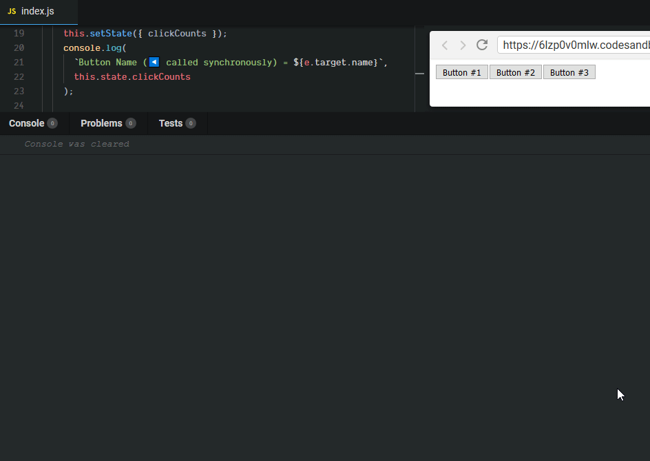
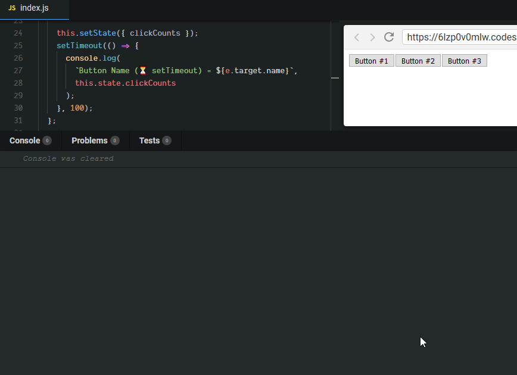
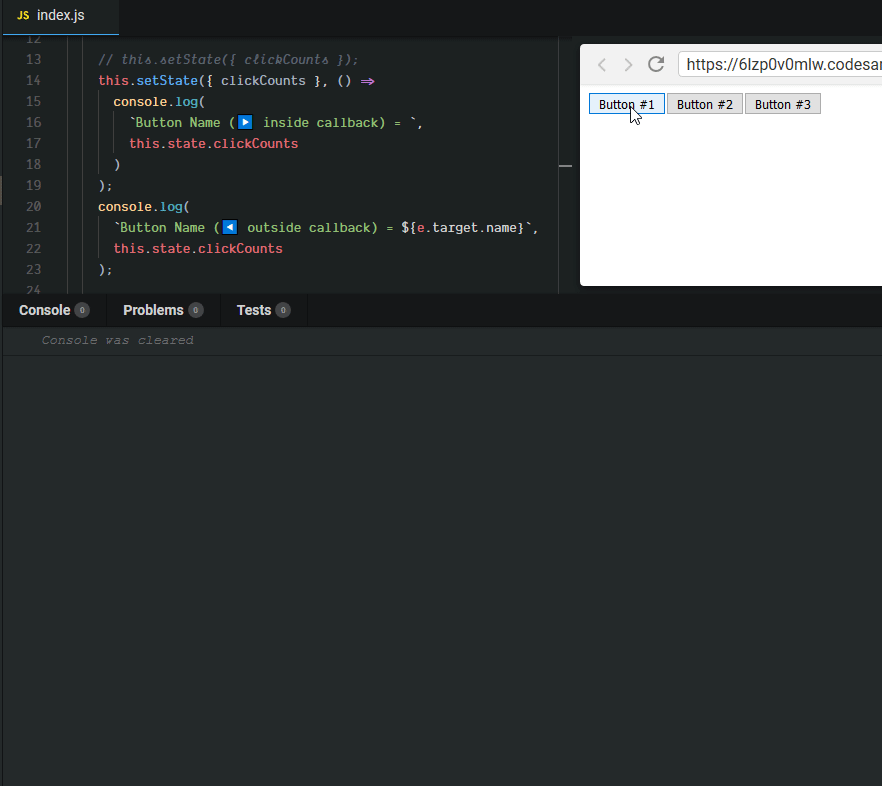
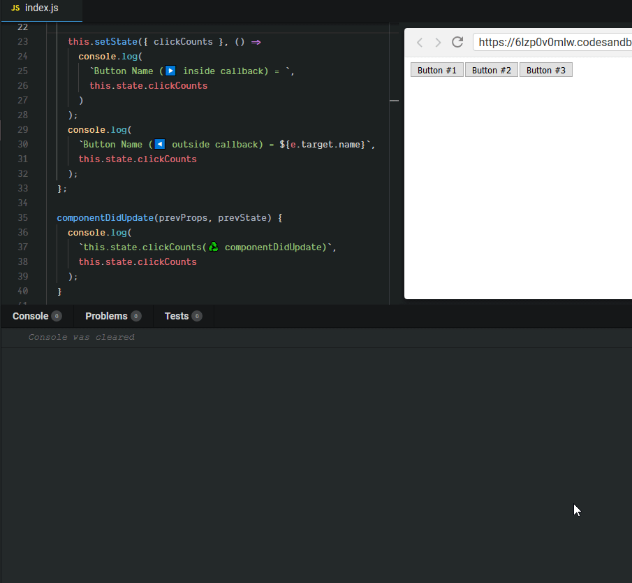

As I have been browsing Stack Overflow questions, I've noticed that many bugs are due to trying to access a state value after setting it.

_An [example question](https://stackoverflow.com/questions/51412391) on Stack Overflow._

I've stumbled many times for being unaware of `setState` being an asynchronous operation.

How do we access the state value right after setting it then?

## 😬 Reproducing the Problem

Here is the code that shows accessing a state value (`clickCounts`) right after setting it synchronously.

[View Gist on GitHub](https://gist.github.com/dance2die/5098bb920c1cd569d1c38bf750cd3f94)

And let's see the logical error.

`console.log` doesn't have access to updated state value even though the call is made after `setState`.

## 😒  Workaround (Not Recommended)

As `setState` is an operation, you can just wait till the value is set by React.

You might wait for a certain period to access the updated state using `setTimeout`.

[View Gist on GitHub](https://gist.github.com/dance2die/9735e8714ab1796f41ec30dea6a2ea81)

Tada 🎉. It works right?

Yes but No, at this point, you are just praying 🙏 that `setState` finishes before accessing the state within `setTimeout`.

And also, you need to persist the event to be able to access event argument as shown in line#2 (`e.persist()`).

_Refer to [Event Pooling](https://reactjs.org/docs/events.html#event-pooling) for e.persist._

## 😄 Recommend Ways

There are **two** ways as mentioned in the official React documentation.

1.  Using a callback passed to `setState`.
2.  Using `componentDidUpdate` life cycle method

Let's go over them both.

### 1\. Using a callback passed to `setState`

`setState` has the following [signature](https://reactjs.org/docs/react-component.html#setstate).

[View Gist on GitHub](https://gist.github.com/dance2die/7c39e80f4b587e0c1f92e77a28333b52)

The callback is called after the state has updated using `updater` method thus the callback has access to the updated `this.state`.

Here is the updated code & the demo.

`gist:dance2die/8afe95dedfbe62e77de813ae2b41a2b0`

<a href="https://gist.github.com/dance2die/8afe95dedfbe62e77de813ae2b41a2b0">View this gist on GitHub</a>

### 2\. Using `componentDidUpdate` life cycle method

React documentation "[generally recommends](https://reactjs.org/docs/react-component.html#setstate)" using `componentDidUpdate`.

_I haven't been able to find the reason for it, but my guess is because `componentDidUpdate` has access to the previous props and previous state (as well as being called before the callback as my demo shows)._

Here is the code using `componentDidUpdate`.

`gist:dance2die/a728b6f1819ede5e1beefeedd64f2e24`

<a href="https://gist.github.com/dance2die/a728b6f1819ede5e1beefeedd64f2e24">View this gist on GitHub</a>

And this demo shows that `componentDidUpdate`

1. has the access to the updated state value.
2. is called before the setState's callback method.

## 👋 Parting Words

Frankly speaking, I've only used the callback to access updated value because I only found out about the recommended way of using `componentDidUpdate` while writing this blog 😝.

And you can play around with the demo on [CodeSandBox](https://codesandbox.io/s/6lzp0v0mlw).
