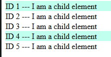
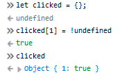
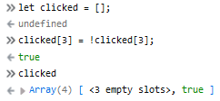

[Adokiye Iruene](https://stackoverflow.com/users/9561595/adokiye-iruene) asked a question on StackOverflow regarding applying a style on a clicked component not all the sibling components.  
  
[Change style for only clicked on view not all views](https://stackoverflow.com/questions/51516825/)  

The problem is that the Asokiye generated components with a list of records in a state.  
  
When a user clicked on a component, not only clicked component had a style applied, but also sibling components.

How can we apply a style only on a clicked component from a list of components?  
_If you want to know the answer you can cheat_ 😈_  by going directly to the [answer.](https://stackoverflow.com/a/51517907/4035)_

## 🗞 Preface

I will use a simple webpage that displays a list of texts wrapped in a component, `Child`.  

Sample Code Output

https://www.youtube.com/watch?v=d5OM-cuPWPo&hd=1

How it works

When you click on an item, the page will highlight only the clicked line. by applying the following class, `highlight`.

[View Gist on GitHub](https://gist.github.com/dance2die/c2dda43a478f8a06a9075fcfda146688)

Let's see how to apply that style per component on click.

You can follow along on CodeSandBox

## 👩‍💻 Relevant Codes

`Child` component returns texts and applies a style depending whether it's clicked or not (using `isClicked` prop).

[View Gist on GitHub](https://gist.github.com/dance2die/ee599566a6f79f5a57962075080a07d8)

`App.js` renders Child components.

[View Gist on GitHub](https://gist.github.com/dance2die/bdf5546e36fa6b707399152a6476b389)

## 📊 Analysis

What needs to happen is that we need to keep a track of all on/off states of each component so that we can turn the state of each component on/off.  
_So let's track on/off states._  

[View Gist on GitHub](https://gist.github.com/dance2die/dc8503f15fc4ccbd9965cebc2f45c54f)

_I've declared it as an object, instead of as an array, I will get to it later_.  
(I promise 🤞)  

Let's look at what happens when a user clicks on a Child component

[View Gist on GitHub](https://gist.github.com/dance2die/b266166eeab17637eddfaa524ef0ff12)

OK, it's kind of hard to digest it so let's go through it line by line.

On line#4, I am getting all previously clicked states.  
`const clicked = { ...prevState.clicked };`  
_using an [object spread syntax](https://developer.mozilla.org/en-US/docs/Web/JavaScript/Reference/Operators/Spread_syntax#Spread_in_object_literals)._  

, toggle previous state.  
`clicked[i] = !clicked[i];`  

Lastly, set the `clicked` state to the updated one.  
`return { clicked }; // same as return { clicked: clicked };  
`_Note that if the property name is same as the object key, you can [shorten it](https://www.benmvp.com/learning-es6-enhanced-object-literals/)._  

Now the question is, there is no property in the first place to set to in `clicked[i] = !clicked[i]`???

## ⚒ A bit of Hack

OK, I've used a bit of JavaScript weirdness to set the clicked state of currently selected item.  
I won't go into too much details as JavaScript's truthiness gets **very** hairy 😠💢.  
  
_So I refer you to this article,_ [Mastering JavaScript’s && and || logical operators](https://blog.usejournal.com/mastering-javascripts-and-logical-operators-fd619b905c8f) by [Nicolas Marcora](https://blog.usejournal.com/@nicolasmarcora) _if you want more details._  

But what you need to know is that **`!undefined` returns true.**

So what happens in `clicked[i] = !clicked[i]` is that, `clicked` is an empty object initially `{}`.  
And `!clicked[i]` will be `undefined` and negating it with `!` operator will turn it into `true`.  

<iframe src="https://giphy.com/embed/l0IpXP8BwnMXvcOze" width="480" height="140" frameborder="0" class="giphy-embed" allowfullscreen></iframe>

[via GIPHY](https://giphy.com/gifs/emoticon-table-flip-nog-l0IpXP8BwnMXvcOze)

Negating undefined

`clicked` object will have an item with value of `1` as the key and the on/off state as the value.

Now let's get back to the previous question, why use an _object_ instead of an _array_ to keep a track of clicked states?

## 🤔 Why use an object?

This is to save previous memory as setting an empty array by index greater than 0 results in filling rest of space with `undefined`.  
  
Suppose that we declared `state = { clicked: []}`, then setting a value above first item would populate the array with `undefined` as shown below.  

Wasted memory

I've set a value for the 4th item, `clicked[3] = !clicked[3];` and the array ended up adding the `!clicked[3]` value with `undefined` (<3 empty slots>) for first 3 items.

Array vs. Object

You can 👀 see ☝️ that the object version stores states of clicked items only.

## 🚀 Full Source Code

As mentioned above, you can see the working demo on [CodeSandBox](https://codesandbox.io/s/p7034m9n5x).  
Here is the full source code (for completeness).  

[View Gist on GitHub](https://gist.github.com/dance2die/0a123f4e28b08cfc4f933e1f0880fcb6)

## 👋 Partying Words

The gist is that, keep a track of each component state in an object and toggle it.

* * *

👋

