Installed [Kubuntu 20.04 LTS](https://kubuntu.org/) (KDE version of Ubuntu) on my old laptop.  

Had a bit of trouble setting up Korean input so decided to share here.

I will use KDE GUI for the majority of the tasks here.

## Table of Contents

1. Install Korean
1. Install [ibus-hangul](https://github.com/libhangul/ibus-hangul)
1. Configure ibus
1. Autostart ibus-daemon
1. Trying out Korean input

## 1. Install Korean

1. Go to Application Launcher, and search & select "Language"
    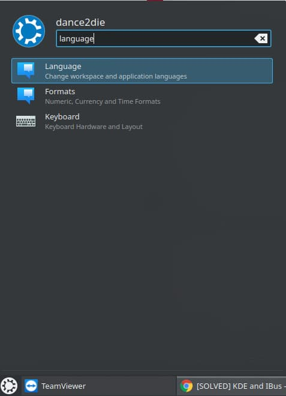
1. Click on "Add languages..." button
1. Select Korean (한국어) & click on "Add" button
    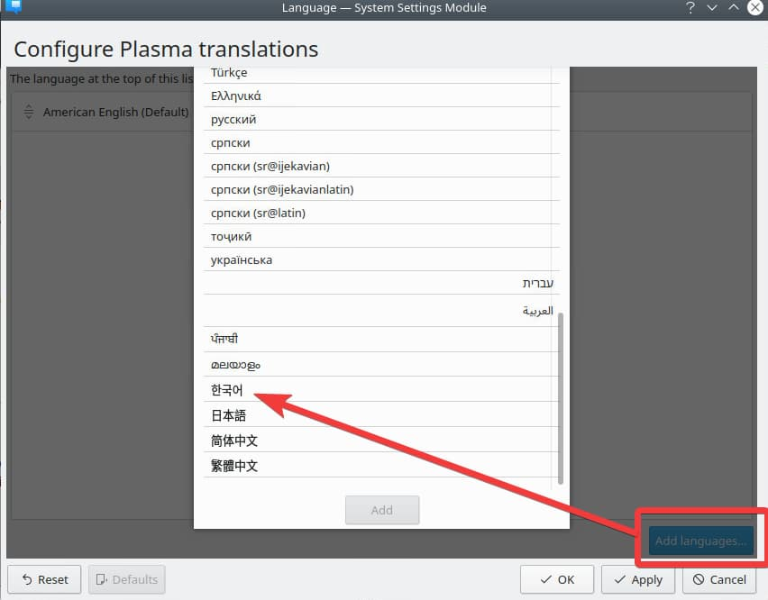

Now Korean is available in your system so let's move on and install `ibus-hangul`, which supports Korean input.

## 2. Install ibus-hangul

Quick and easy way is to install `ibus-hangul` is via `apt` command,

```bash
sudo apt install ibus-hangul
```

Let's now configure `ibus` to work with Korean next.

## 3. Configure ibus

1. Go to Application Launcher, and search & select "Ibus Preferences"
    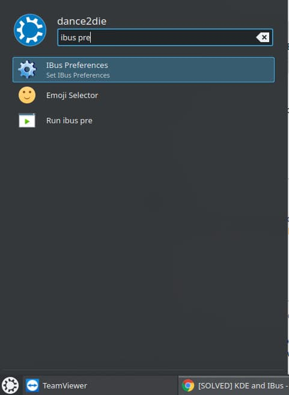
    - You will see that the default "Next input method" is `<Super>space`
    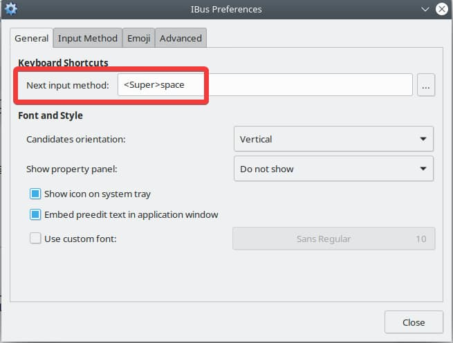
    - `<Super>` is the "Windows" key on your keyboard
    - So you can press `Windows + space` to switch between English & Korean
1. Go to "Input Method" tab, and click on "Add" button
1. Find and select Korean (한국어) and click on "Add" button, and close the preferences dialog
    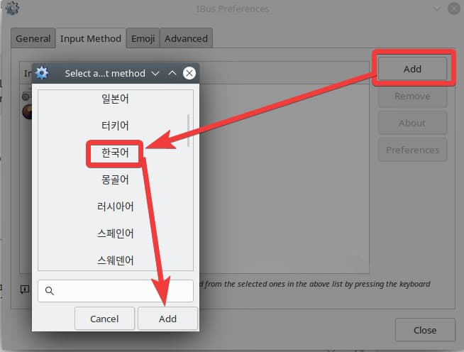

You might get prompted to start `ibus-daemon` when you opened "Ibus Preferences".  
It's a one-off execution, so when you restart your machine, you'd need to start the `ibus-daemon` manually.  

As it's a pain, let's autostart the daemon on log on.

## 4. Autostart ibus-daemon

1. Go to Application Launcher, and search & select "Autostart"
    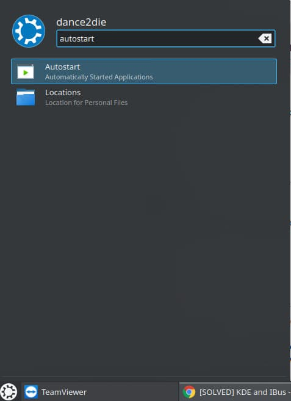
1. Click on "Add Program" button and then "Open file dialog" button
    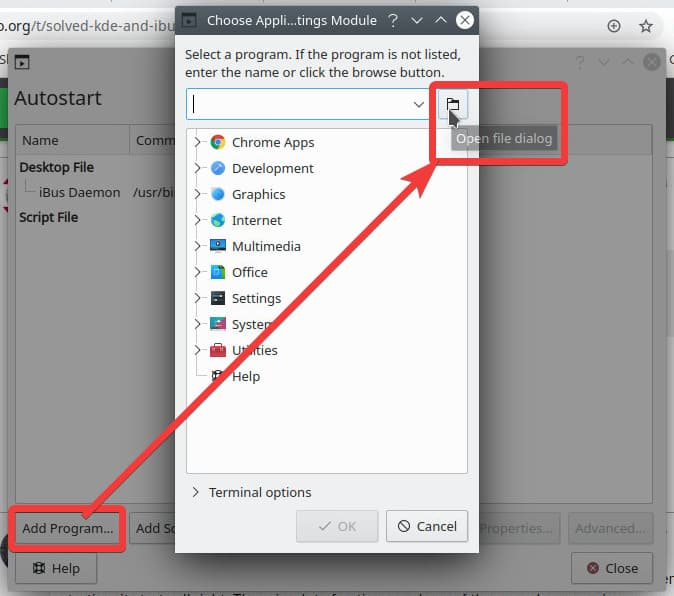
1. In the "Name" field, add `/usr/bin/ibus-daemon` & click "Open" button
    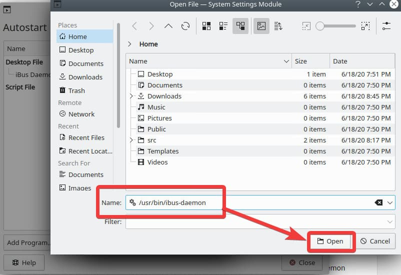
1. Click "OK" to close "Choose Application" dialog, which then opens "Properties for ibus-daemon-desktop" dialog, automatically
    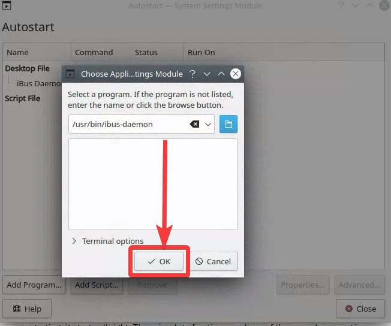
1. Go to "Application" tab and add `-d` in the "Command" to start the daemon in the background.
    - "Command" field should be `/usr/bin/ibus-daemon -d`
      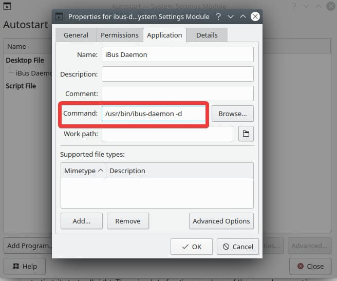
    - You will now see the command under "Desktop File"
      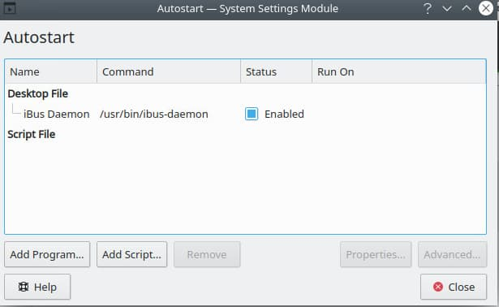
1. Save and close with "OK" button

⚠ At this point you need to restart your machine.

## 5. Trying out Korean input

After you restarting the machine, open up a browser and press `<Super>space` to change the language to Korean.  

  

At this point, we haven't set the default language for Korean input to be Korean.  You can start using Korean after pressing `shift + space`.  
You can change the default keyboard binding in the preferences screen.


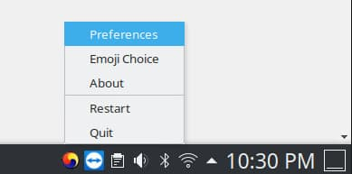  
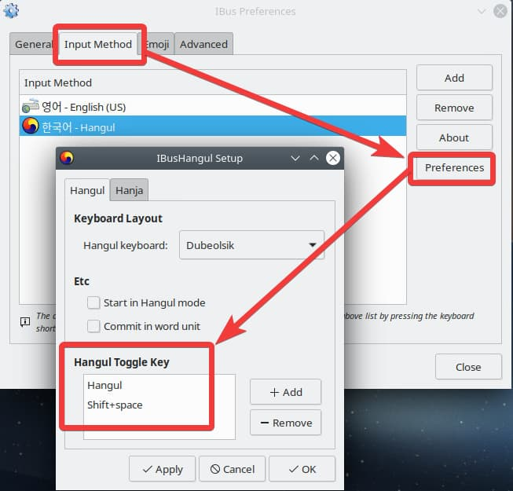  

You should now be able to type in Korean (I am using VS Code below)
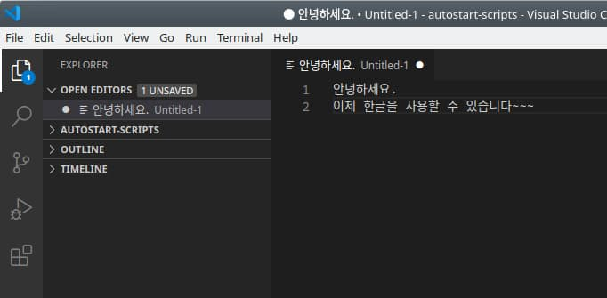

---

Image by <a href="https://pixabay.com/photos/?utm_source=link-attribution&amp;utm_medium=referral&amp;utm_campaign=image&amp;utm_content=407695">Free-Photos</a> from <a href="https://pixabay.com/?utm_source=link-attribution&amp;utm_medium=referral&amp;utm_campaign=image&amp;utm_content=407695">Pixabay</a>